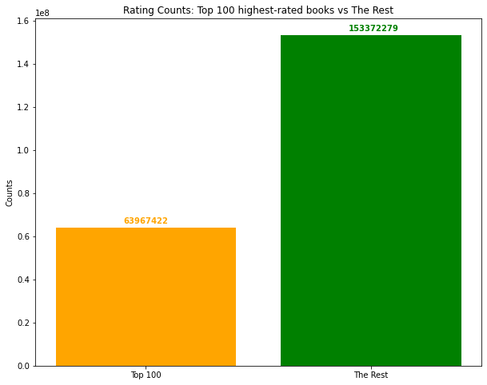
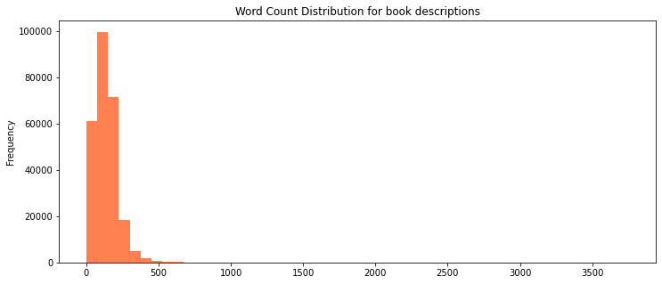
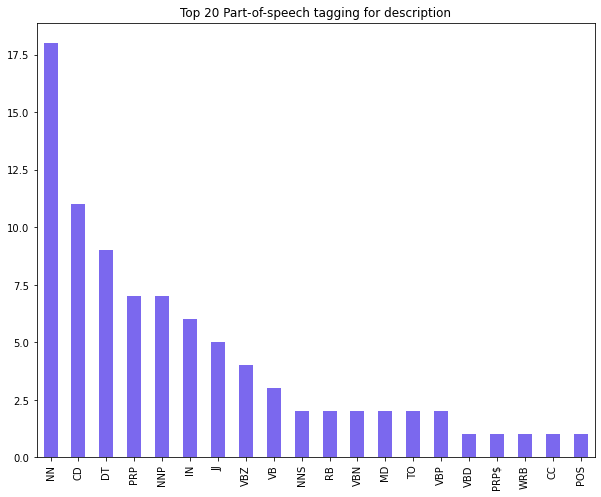
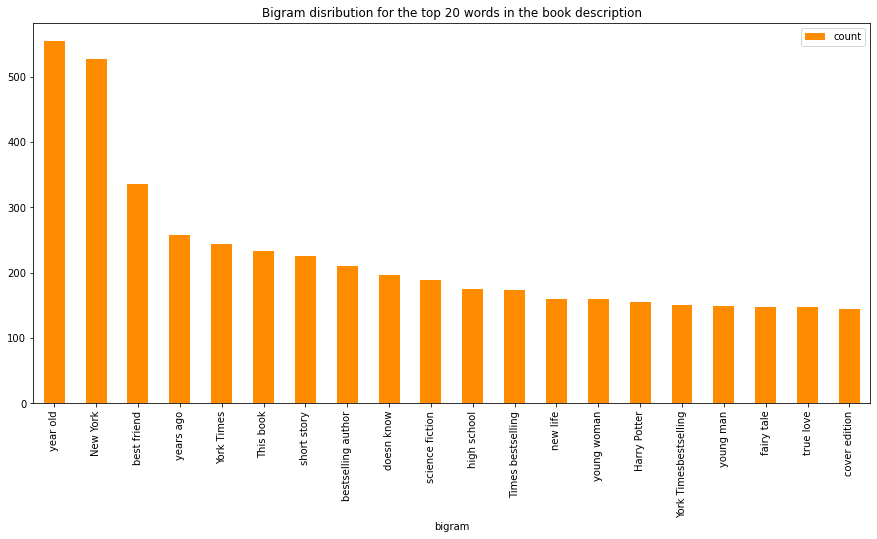
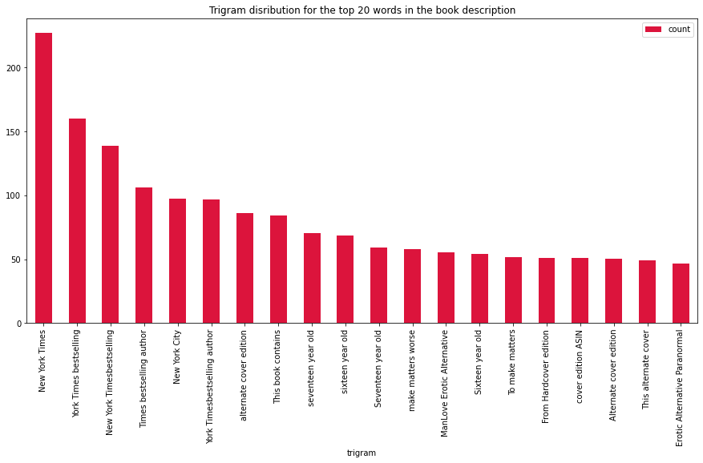
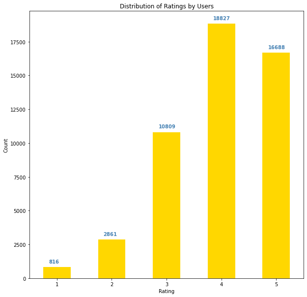
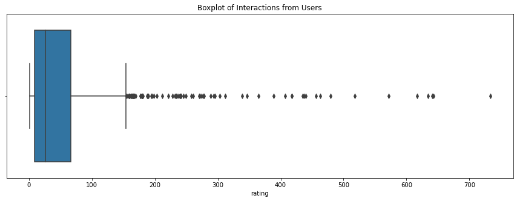
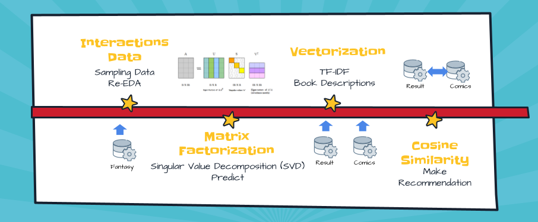
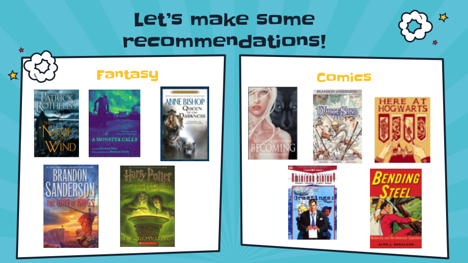

# Comic Books Recommendation System  
## Based on Fantasy Book Preferences

By Ramil Chaimongkolbutr

## Overview

Recommendation system has been an integral part of tech companies' success for years. It helps generate around 35% of Amazon's revenue; it increases 33% of Spotify users; it contributes to 75% of what users watch on Netflix; and it is accounted for 60% of video clicks on Youtube. Recommendation system is used in a variety of areas, with commonly recognized examples taking the form of playlist generators for video and music services, relatable product recommenders for online stores, or content recommenders for social media platforms, or personalized topics such as restaurants and online dating.

## Business Problems

Amazon Books are looking to expand their sale in fantasy book section. Their plan is not only limited to recommending books within a certain genres, but also introducing new books from a different genres. We are tasked to build up a recommendation system that allows us to recommend cross-genre books, which in our case, comic books, to a customer based on his/her preference in fantasy book.

## Data

Data was collected directly from Goodreads API in 2017 and made availble by [Mengting Wan et al.](https://sites.google.com/eng.ucsd.edu/ucsdbookgraph/home) online (please click the name for the link to download). For more infomation, please visit Mengting's [Github repository](https://github.com/MengtingWan/goodreads).

**Note**: the dataset is too large to be uploaded on github.  
Here are steps to acquire the dataset in order to make our codes work:
1. Download these following datasets:
    - "goodreads_books_comics_graphics.jason.gz" by this [link](https://drive.google.com/uc?id=1ICk5x0HXvXDp5Zt54CKPh5qz1HyUIn9m).
    - "goodreads_interactions_comics_graphic.json.gz" by this [link](https://drive.google.com/uc?id=1CCj-cQw_mJLMdvF_YYfQ7ibKA-dC_GA2).
    - "goodreads_books_fantasy_paranormal.json.gz" by this [link](https://drive.google.com/uc?id=1x8IudloezYEg6qDTPxuBkqGuQ3xIBKrt).
    - "goodreads_interactions_fantasy_paranormal.json.gz" by this [link](https://drive.google.com/uc?id=1EFHocJIh5nknbUMcz4LnrMEJkwW3Vk6h).
2.    Create a folder and name it "data", then move all the dataset into the folder.
3.    unzip all the data file. Make sure that all the data does not have .gz at the end of its name (gunzip command in gitbash can be useful in this case).  

The datasets we use in this project contain over 250000 fantasy books and over 85000 comic books. They also contain over 60 milion reviews from all over 100000 users. The rating reviews score between 1-5 stars (5 is "it is amazing!" to 1 is "Didn't like it at all"). The metadata also contains key features such as book_id, title, description, average rating, and image links.

## EDA
### Explore the Rating Counts
Rating Counts: Top 100 highest-rated books vs The Rest 



From the graph, we can see that the higher rated books trend to attach more reviewers. In top 100 highest-rated books, it has almost a half as many reviews as the rest of 258485 books. Let's get to know which one has the most rating counts.

### Word Count Distribution
We want to gain some insight from book descriptions. We plan to use this feature to find similarity between two datasets. Since we are working with the fantasy book dataset, we start by taking a look on its word count distribution first.



The average word count is around 200 words.

### Part-of-speech tags Distribution in book descriptions
Let's check out the distribution of its part-of-speech. This section we will use the help from Textblob library. Textblob library is an open-source python library for processing textual data. It performs different operations on textual data such as noun phrase extraction, sentiment analysis, classification, translation, etc.



### Bigram and Trigram Distribution
Let's take a look on the distribution of bigram and trigram.




### Exploring the interaction dataset
Distribution of ratings in our interaction dataset.



The distribution of rating in our dataset is left-skewed. Majority of users trend to rate books are quite optimistic, meaning that they trend to rate books with high regards.

Box plot for user interactions.



As you can see, the medium is 26 reviews per user while the mean is around 57 review per user. The large gap is a result of having some outliers with extremely high numbers of interactions. For example, there is one user rates the total of 733 books; there are a few users rate above 500 books.

## Methodology



We start building up our methodology by down-sizing the interaction dataset to a more manageable size. We choose to build our recommendation system using collaborative filtering algorithm. Matrix Factorization is out go-to class because of its effectiveness. The prediction results can be improved by assigning different regularization weights to the latent factors based on items' popularity and users' activeness. We will use Alternative Least Square (ASL) model from PySpark library as our first simple model.

After we get our FSM and ALS models up and running. I try to look for options to improve our model. I turn to Singular Value Decomposition (SVD) from Surprise library. The famous SVD algorithm, as popularized by Simon Funk during the Netflix Prize in 2006. 

We finalize our final model based on RMSE (this is also for the consistency among other models). Then, we will build up our recommendation function which takes in a user input and gives out a book recommendation as a prediction.

The method that we use to find similarity between fantasy books and comic books is Cosine Similarity. We take a book description, vectorize it, and calculate cosine similarity between them. Finally, we make recommendations based on the high similarity score of the book. 

## Results

| Model       | RMSE        |
| :---        |    ---:     |
| ALS         | 1.093       | 
| KNNBasic    | 1.002       |
| KNNBaseline | 0.886       |
| SVD         | 0.837       |

The result from RMSE suggests us to choose SVD as our final model. We later build a recommendation function out of the final SVD model.

## Conclusions

- Our final model is SVD with the lowest RMSE of 0.837. 
- We are pretty impressed with the results so far. 

### Example of results from our recommendation system:

We randomly add a new user id with some random book rating to the system. Here are some of the results from our recommendation system.



We can see some similarities between the results of fantasy books and comic books. For example, the system recommends "Here at Hogwarts" from the Harry Potter book in fantasy book result. 


## Next Steps

- If we had more resources and computing power, we could start run on a larger sets of data.
- We could try on building a recommendation using Neural Network, which might yield a better result.
- We could try running on even more distinctive groups of data.
- Online A/B testing might be a better way to evaluate the model. Wayfair is now using this method to evaluate their recommendation system.

## Implementation

We take our finished recommendation system and implement it onto web app using Streamlit. We later deploy it online via Heroku. Please visit our recommendation system web app by following this link--[gr-comic-recommendation.herokuapp.com](https://gr-comic-recommendation.herokuapp.com/). 
 
## For More Information

See full analysis in these following Jupyter Notebooks:
1. [recommendation_book](./recommendation_book.ipynb) 
2. [ALS_model](./ALS_model.ipynb)
3. [Surprise_Lib](./Surprise_Lib.ipynb)
4. [Recom_function](./Recom_function.ipynb)

Or check out this [presentation](./capstone_slidedeck.pdf). 

For additional info, please contact:  
Ramil Chaimongkolbutr at [ramil.ming@gmail.com](mailto:ramil.ming@gmail.com)  


## Repository Structure

```
├── data
├── images
├── README.md
├── capstone_slidedeck.pdf
├── recommendation_book.ipynb
├── ALS_model.ipynb
├── Surprise_Lib.ipynb
├── Recom_function.ipynb
```
